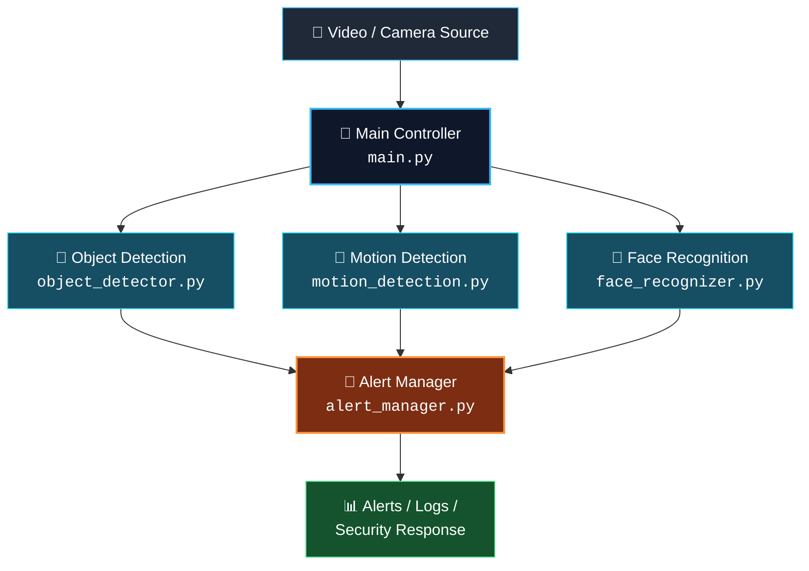

<div align="center">

# 🛡️ AI Surveillance System

### Real-time, AI-powered video surveillance built entirely in Python

A modular framework combining **Object Detection**, **Motion Detection**, **Face Recognition**, and **Alert Management** to monitor video streams and flag suspicious activity automatically.

[](https://www.python.org/)
[](https://opencv.org/)
[](#-license)
[](#)

[Features](#-features) • [Architecture](#-system-architecture) • [Installation](#️-installation) • [Usage](#️-run-the-project) • [Modules](#-core-modules) • [Roadmap](#-future-improvements)

</div>

---

## 🚀 Features

| | |
|---|---|
| 🎥 | **Real-Time Video Surveillance** — continuous monitoring of live or recorded streams |
| 🎯 | **Object Detection** — identify objects of interest in each frame |
| 🏃 | **Motion Detection** — flag movement within the monitored scene |
| 👤 | **Face Recognition** — detect and recognize known individuals |
| 🚨 | **Alert Management** — centralized handling of detection events |
| 🔧 | **Modular Architecture** — swap or extend components independently |
| ⚙️ | **Configurable Detection Settings** — tune sensitivity per module |
| 📊 | **Detection / Alert Logging** — keep a record of every event |

---

## 🧠 System Architecture



> Frames flow from the video source into the main controller, which fans them out to the three detection modules in parallel. Every detection result converges on the Alert Manager, which logs the event and triggers the appropriate response.

---

## 📂 Project Structure

```
AI_Surveillance_System/
│
├── config/                  # Configuration files
├── utils/                   # Utility / helper modules
│
├── main.py                  # Main application entry point
├── object_detector.py       # Object detection module
├── motion_detection.py      # Motion detection module
├── face_recognizer.py       # Face detection and recognition
├── alert_manager.py         # Handles surveillance alerts
│
├── requirements.txt         # Python dependencies
└── .gitignore
```

---

## 🛠️ Technologies Used

| Technology | Purpose |
|---|---|
| 🐍 **Python** | Core programming language |
| 👁️ **Computer Vision** | Video analysis |
| 🎯 **Object Detection** | Detect objects in frames |
| 👤 **Face Recognition** | Identify known faces |
| 🏃 **Motion Detection** | Detect movement |
| 🚨 **Alert Manager** | Manage security alerts |

---

## ⚙️ Installation

**1. Clone the repository**
```bash
git clone https://github.com/vishalyadav7091/AI_Surveillance_System.git
```

**2. Open the project**
```bash
cd AI_Surveillance_System
```

**3. Create a virtual environment**
```bash
python -m venv venv
```

**4. Activate the virtual environment**

Windows:
```bash
venv\Scripts\activate
```

Linux / macOS:
```bash
source venv/bin/activate
```

**5. Install dependencies**
```bash
pip install -r requirements.txt
```

---

## ▶️ Run the Project

```bash
python main.py
```

> ⚠️ Make sure your camera/video source and required configuration are set up correctly before running the application.

---

## 🔍 Core Modules

### 🎯 Object Detection
Analyzes video frames and identifies objects of interest.

**Applications:** Security monitoring · Restricted-area monitoring · Suspicious-object detection · Automated surveillance

### 🏃 Motion Detection
Identifies movement within the monitored scene.

**Useful for:** Intrusion detection · Activity monitoring · Security cameras · Restricted areas

### 👤 Face Recognition
Detects and recognizes known individuals from video input.

### 🚨 Alert Management
Processes detected events and provides a centralized mechanism for handling surveillance alerts.

---

## 🔮 Future Improvements

- [ ] Web-based surveillance dashboard
- [ ] Multiple camera support
- [ ] Real-time notifications
- [ ] Email/SMS alert integration
- [ ] Cloud-based event storage
- [ ] Database integration
- [ ] Advanced anomaly detection
- [ ] Person tracking
- [ ] Mobile application
- [ ] Docker deployment
- [ ] AI-based suspicious activity detection

---

## 🔐 Security & Privacy

This project is intended for **authorized security and monitoring purposes only**.

When deploying a surveillance system:

- ✅ Obtain appropriate consent where required
- ✅ Protect stored video and recognition data
- ✅ Avoid unnecessary collection of personal information
- ✅ Secure access to cameras and system logs
- ✅ Follow applicable privacy and data-protection laws

---

## 📌 Use Cases

<table>
<tr>
<td>🏠 Smart Home Security</td>
<td>🏢 Office Surveillance</td>
<td>🏫 Campus Monitoring</td>
</tr>
<tr>
<td>🏭 Industrial Security</td>
<td>🚪 Restricted Area Monitoring</td>
<td>🛒 Store Security</td>
</tr>
<tr>
<td>🏥 Facility Monitoring</td>
<td></td>
<td></td>
</tr>
</table>

---

## 📊 Project Goals

The main goal of this project is to develop an intelligent surveillance system that reduces dependence on continuous manual monitoring by automatically analyzing video streams and identifying potentially important events.

---

## 👨‍💻 Author

**Vishal Kumar Yadav**
AI/ML Student | Python Developer | Computer Vision Enthusiast

🔗 GitHub: [@vishalyadav7091](https://github.com/vishalyadav7091)

---

<div align="center">

## ⭐ Support

If you find this project useful, consider giving it a ⭐ on GitHub!

**Made with ❤️ using Python & AI**

</div>
