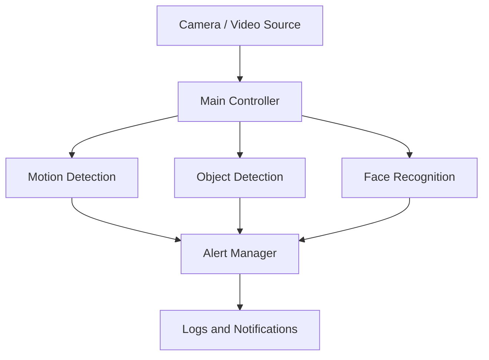

## 🧠 System Architecture

```mermaid
flowchart TD
    A["Camera / Video Source"] --> B["Main Controller"]
    B --> C["Motion Detection"]
    B --> D["Object Detection"]
    B --> E["Face Recognition"]
    C --> F["Alert Manager"]
    D --> F
    E --> F
    F --> G["Logs and Notifications"]
```

The system processes video frames through the configured detection modules and sends relevant events to the alert manager.
